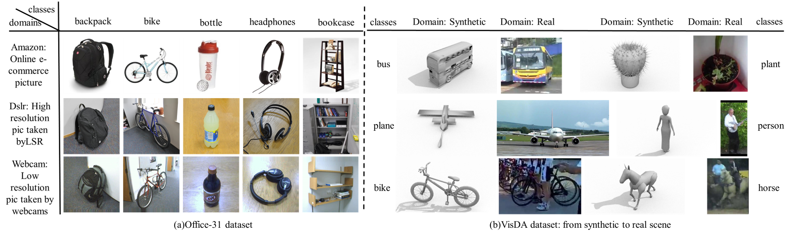
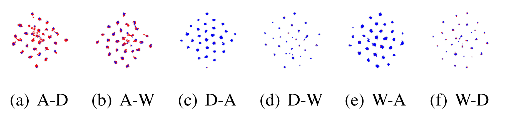

# <div align="center">Structure Consistent Unsupervised Domain Adaptation for Driver Behavior Recognition</div>

## Samples of [Office-31](https://faculty.cc.gatech.edu/~judy/domainadapt/) dataset and [VisDA](https://ai.bu.edu/visda-2017/) dataset


## Results on [Office-31](https://faculty.cc.gatech.edu/~judy/domainadapt/) dataset and [VisDA](https://ai.bu.edu/visda-2017/) dataset
Data distributions in the learned feature space by the proposed method for the six tasks on [Office-31](https://faculty.cc.gatech.edu/~judy/domainadapt/) dataset



Unsupervised domain adaptation classification accuracy (%) on [Office-31](https://faculty.cc.gatech.edu/~judy/domainadapt/) dataset

| Method                      | A-D      | A-W         | D-A         | D-W      | W-A         | W-D     | Avg.        |
| --------------------------- | -------- | ----------- | ----------- | -------- | ----------- | ------- | ----------- |
| ResNet-50                   | 68.9     | 68.4        | 62.5        | 96.7     | 60.7        | 99.3    | 76.1        |
| DANN                        | 79.7     | 82.0        | 68.2        | 96.9     | 67.4        | 99.1    | 82.2        |
| CDAN+E                      | 92.9     | 94.1        | 71.0        | 98.6     | 69.3        | **100** | 87.7        |
| CDAN+BSP                    | 93.0     | 93.3        | 73.6        | 98.2     | 72.6        | **100** | 88.5        |
| CDAN+TN                     | 94.0     | 95.7        | 73.4        | 98.7     | 74.2        | **100** | 89.3        |
| SHOT                        | 94.0     | 90.1        | 74.7        | 98.4     | 74.3        | 99.9    | 88.6        |
| ViT                         | 90.8     | 90.4        | 76.8        | 98.2     | 76.4        | **100** | 88.8        |
| SHOT-B                      | 95.3     | 94.3        | 79.4        | **99.0** | 80.2        | **100** | 91.4        |
| [CDTrans](https://github.com/CDTrans/CDTrans) | <u>97.0  | <u>96.7</u> | <u>81.1</u> | **99.0** | <u>81.9</u> | **100** | <u>92.6</u> |
| Ours                        | **98.8** | **97.2**    | **83.6      | **99.0** | **82.3      | **100** | **93.5**    |

Unsupervised domain adaptation classification accuracy (%) on [VisDA](https://ai.bu.edu/visda-2017/) dataset.

| Method           | **plane**     | bcycl | bus  | car  | horse       | knife       | mcycl | person | plant | sktbrd | train | truck       | Avg.        |
| ------------------ | ------------- | -------------- | ------------- | ------------- | -------------- | -------------- | -------------- | --------------- | -------------- | --------------- | -------------- | -------------- | ------------- |
| src-only           | 63.6          | 35.3           | 50.6          | <u>78.2</u> | 74.6           | 18.7           | 82.1           | 16.0            | 84.2           | 35.5            | 77.4           | 4.7            | 56.9          |
| DAN                | 89.2          | 37.2           | 77.7          | 61.8          | 81.7           | 64.3           | 90.6           | 61.4            | 79.9           | 37.7            | 88.1           | 27.4           | 67.2          |
| ADDA               | <u>95.6</u> | 70.8           | **84.4**    | 54.0          | 87.8           | 75.8           | 88.4           | 69.3            | 84.1           | 86.2            | 85.0           | 48.0           | 74.3          |
| DANN               | 93.5          | 74.3           | <u>83.4</u> | 50.7          | 87.2           | 90.2           | 89.9           | 76.1            | 88.1           | 91.4            | 89.7           | 39.8           | 74.9          |
| CDAN               | 94.3          | 53.0           | 75.7          | 60.5          | 93.9           | **98.3**    | **96.4** | 77.5            | 91.6           | 81.8            | 87.4           | 45.2           | 79.6          |
| MCC                | 95.3          | <u>85.8</u> | 77.1          | 68.0          | <u>93.9</u> | 92.9           | 84.5           | <u>79.5</u> | <u>93.6</u>    | <u>93.7</u> | 85.3           | <u>53.8</u> | 80.4          |
| [TVT](https://github.com/uta-smile/TVT) | 92.9          | 85.6           | 77.5          | 60.5          | 93.6           | <u>98.2</u> | 89.3           | 76.4            | <u>93.6</u> | 92.0            | <u>91.7</u> | **55.7** | <u>83.9</u> |
| Ours               | **97.6**    | **87.0** | 79.3          | **82.3**    | **97.2** | 88.4           | <u>94.7</u> | **83.0** | **95.6** | **97.8** | **92.2** | 52.8           | **87.3** |


## Getting started

* ### Requirements
	<ul>
	<li>pytorch 1.9.1</li>
	<li>torchvision 0.10.1</li>
	<li>wandb 0.12.2</li>
	<li>timm 0.5.5</li>
	<li>prettytable 2.2.0</li>
	<li> scikit-learn </li>
	</ul>
* ### Installation
```
pip install -r requirements.txt
```
We use Weights and Biases ([wandb](https://wandb.ai/site)) to track our experiments and results. To track your experiments with wandb, create a new project with your account. The ```project``` and ```entity``` arguments in ```wandb.init``` must be changed accordingly. To disable wandb tracking, the ```log_results``` flag can be used. 

* ### Datasets
   The datasets used in the repository can be downloaded from the following links:
	   <ul>
	   <li>[VisDA-2017](https://github.com/VisionLearningGroup/taskcv-2017-public) (under classification track)</li>
	   </ul>
	The datasets are automatically downloaded to the ```data/``` folder if it is not available.
## Training
The training scripts can be found under the `examples` subdirectory. 
Sample command to execute the training of the aforementioned methods with a ViT B-16 backbone,  on VisDA dataset can be found below. 
```
python examples/structure_consist_UDA.py /data/VisDA/ -d VisDA2017 -s Synthetic -t Real -a vit_base_patch16_224 --epochs 30 --seed 0 --no-pool --train-resizing cen.crop --log logs/SCUDA_vit/VisDA2017 --log_name VisDA2017_SCUDA_vit --lr 0.002 --log_results -b 64 -j 4
```

## Overview of the arguments
Generally, all scripts in the project take the following flags
- `-a`: Architecture of the backbone. (resnet50|vit_base_patch16_224)
- `-d`: Dataset (VisDA|Driver) 
- `-s`: Source Domain
- `-t`: Target Domain
- `--epochs`: Number of Epochs to be trained for.
- `--no-pool`: Use --no-pool for all experiments with ViT backbone.
- `--log_name`: Name of the run on wandb.
- `--gpu`: GPU id to use.

## Acknowledgement
Our implementation is based on the [Transfer Learning Library](https://github.com/thuml/Transfer-Learning-Library).
